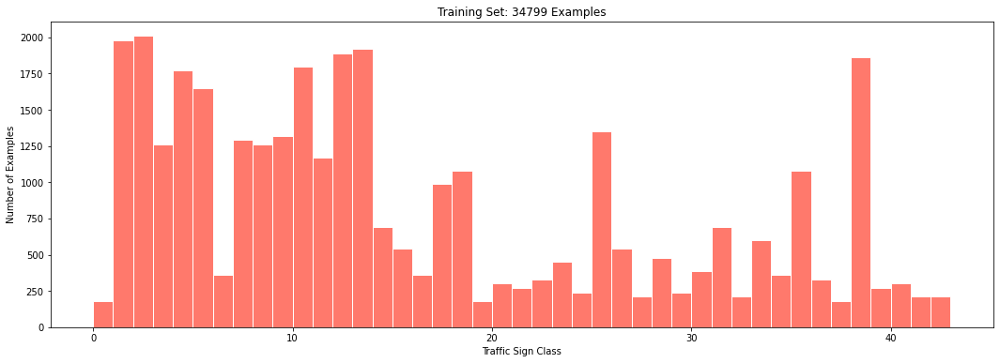
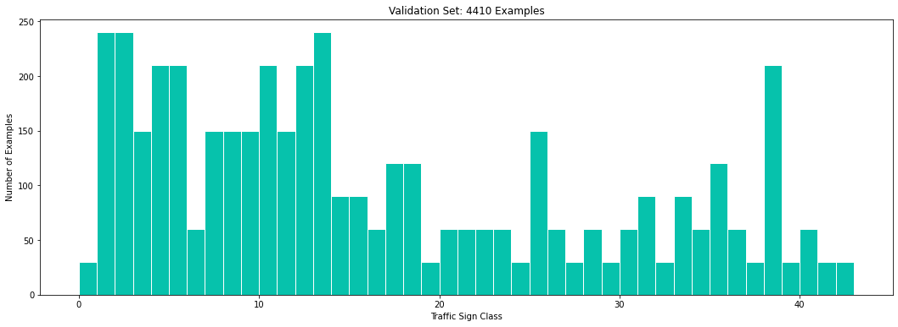
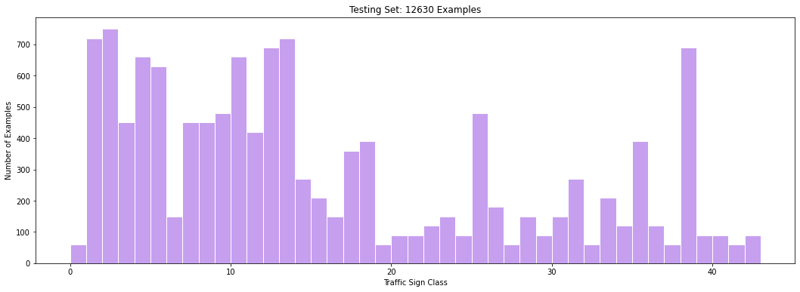
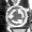
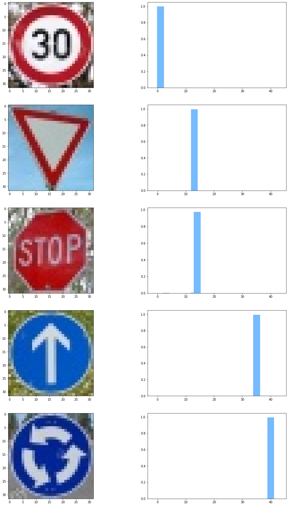

# **Traffic Sign Recognition** 

This project implements a convolutional neural network to classify traffic signs. The model is trained and validated using the [German Traffic Sign Dataset](http://benchmark.ini.rub.de/?section=gtsrb&subsection=dataset).

The goals / steps of this project are the following:

* Load the data set (see below for links to the project data set)
* Explore, summarize and visualize the data set
* Design, train and test a model architecture
* Use the model to make predictions on new images
* Analyze the softmax probabilities of the new images
* Summarize the results with a written report

## Rubric Points
### Here I will consider the [rubric points](https://review.udacity.com/#!/rubrics/481/view) individually and describe how I addressed each point in my implementation.  

---
### Writeup / README

#### 1. Provide a Writeup / README that includes all the rubric points and how you addressed each one. You can submit your writeup as markdown or pdf. You can use this template as a guide for writing the report. The submission includes the project code.

You're reading it! and here is a link to my [project code](https://github.com/jasleon/Traffic-Sign-Classifier/blob/master/Traffic_Sign_Classifier.ipynb).

### Data Set Summary & Exploration

#### 1. Provide a basic summary of the data set. In the code, the analysis should be done using python, numpy and/or pandas methods rather than hardcoding results manually.

The features and labels of the dataset are stored in numpy arrays. I used the shape attribute to show the number of examples of each dataset. 

There are multiple ways to show the number of unique classes. I decided to load the `signnames.csv` file to a pandas DataFrame. This allows me to find the sign name of a given class.

Here is the summary:

```
Number of training examples = 34799
Number of validation examples = 4410
Number of testing examples = 12630
Image data shape = (32, 32)
Number of classes = 43
```

#### 2. Include an exploratory visualization of the dataset.

I used matplotlib to compute and draw the histogram of each dataset. In the next figures, each bar represents the number of examples of a given traffic sign class. 

Here is the visualization of the training dataset:

<p align="center">

</p>

Here is the visualization of the validation dataset:

<p align="center">

</p>

Here is the visualization of the testing dataset:

<p align="center">

</p>

### Design and Test a Model Architecture

#### 1. Describe how you preprocessed the image data. What techniques were chosen and why did you choose these techniques? Consider including images showing the output of each preprocessing technique. Pre-processing refers to techniques such as converting to grayscale, normalization, etc. (OPTIONAL: As described in the "Stand Out Suggestions" part of the rubric, if you generated additional data for training, describe why you decided to generate additional data, how you generated the data, and provide example images of the additional data. Then describe the characteristics of the augmented training set like number of images in the set, number of images for each class, etc.)

I decided to convert the images to grayscale because the LeNet architecture works well with only one channel. 

I also applied histogram equalization to the grayscale images because I noticed some of them were too dark. 

Here is an example of the grayscale images:

| RGB Image                                       | Grayscale Image                                 |
| ----------------------------------------------- | ----------------------------------------------- |
|  |  |

As a last step, I normalized the image data because feature scaling speeds up the optimizer.

#### 2. Describe what your final model architecture looks like including model type, layers, layer sizes, connectivity, etc.) Consider including a diagram and/or table describing the final model.

I started with the LeNet architecture from the previous lab. After some experiments, I noticed that this architecture did not generalized well, and therefore the its performance on the validation set was below our target 93%.

I decided to add drop-out layers to improve the regularization of the model.  

My final model consisted of the following layers:

| Layer         		|     Description	        					|
|:---------------------:|:---------------------------------------------:|
| Input         		| 32x32x1 grayscale image |
| Convolution 5x5    | 1x1 stride, valid padding, outputs 28x28x6 |
| RELU					| nonlinear activation |
| Max pooling	      	| 2x2 stride, valid padding, outputs 14x14x6 |
| Drop-out	| 50% keep probability |
| Convolution 5x5	  | 1x1 stride, valid padding, outputs 10x10x16 |
| RELU	| nonlinear activation |
| Max pooling	| 2x2 stride, valid padding, 5x5x16 |
| Drop-out	| 50% keep probability |
| Flatten	| outputs 400 |
| Fully connected	| outputs 120 |
| RELU	| nonlinear activation |
| Fully connected	| outputs 84        |
| RELU	| nonlinear activation |
| Fully connected	| outputs 43        |


#### 3. Describe how you trained your model. The discussion can include the type of optimizer, the batch size, number of epochs and any hyperparameters such as learning rate.

The CNN runs through the training dataset 10 times (epochs). I first shuffle the training data every epoch. Then I divide the training set into batches of 128 examples, the Adam optimizer finds the CNN parameters that reduce the softmax entropy function. I train the CNN until all the batches in the dataset are complete, and repeat the operation in the next epoch.    

Here are the hyperparameters that I used to train the model:

| Parameter        | Value |
| ---------------- | ----- |
| Number of epochs | 10    |
| Batch size       | 128   |
| Learning rate    | 0.001 |

#### 4. Describe the approach taken for finding a solution and getting the validation set accuracy to be at least 0.93. Include in the discussion the results on the training, validation and test sets and where in the code these were calculated. Your approach may have been an iterative process, in which case, outline the steps you took to get to the final solution and why you chose those steps. Perhaps your solution involved an already well known implementation or architecture. In this case, discuss why you think the architecture is suitable for the current problem.

My final model results were:

```
EPOCH 10 ...
Training Accuracy = 0.985 - Validation Accuracy = 0.953
```

The test set accuracy is:

```
Test Accuracy = 0.927
```

*If an iterative approach was chosen:*

* *What was the first architecture that was tried and why was it chosen?*

  At first I tried to use the LeNet architecture from the previous lab by only changing the number of input channels to 3, and the output to 43 classes. I left the hyperparameters unchanged. I chose this architecture because it worked well detecting numbers.

* *What were some problems with the initial architecture?*

  I noticed that I was not getting a good performance on the validation dataset. I firs tried to improve the performance by adding pre-processing steps. These extra steps didn't have a significant impact on performance. 

  I also increased the number of epochs with the same result. The model would increase its performance on the validation step but it plateaued below 93%. 

  I then realized that the poor performance on the validation step indicated that the model was overfitting. 

* *How was the architecture adjusted and why was it adjusted?*

  One way to improve performance in the validation set is adding a dropout layer. The dropout layer randomly sets elements to zero to prevent overfitting.

  I added a dropout layer with a 50% keep probability after each convolutional layer. I did not have to change the hyperparameters from the previous lab.

  


### Test a Model on New Images

#### 1. Choose five German traffic signs found on the web and provide them in the report. For each image, discuss what quality or qualities might be difficult to classify.

Here are five German traffic signs that I found on the web:

| Speed limit (30km/h)                          | Yield                                          | Stop                                           | Ahead only                                     | Roundabout mandatory                           |
| --------------------------------------------- | ---------------------------------------------- | ---------------------------------------------- | ---------------------------------------------- | ---------------------------------------------- |
|  |  |  |  |  |

The stop sign might be difficult to classify because the sign is not facing front. 

#### 2. Discuss the model's predictions on these new traffic signs and compare the results to predicting on the test set. At a minimum, discuss what the predictions were, the accuracy on these new predictions, and compare the accuracy to the accuracy on the test set (OPTIONAL: Discuss the results in more detail as described in the "Stand Out Suggestions" part of the rubric).

Here are the results of the prediction:

```
Image 0 - Target = 01, Predicted = 01
Image 1 - Target = 13, Predicted = 13
Image 2 - Target = 14, Predicted = 14
Image 3 - Target = 35, Predicted = 35
Image 4 - Target = 40, Predicted = 40
> Model accuracy: 1.000000
```

Here are the results with the sign names: 

| Image			        |     Prediction	        					|
|:---------------------:|:---------------------------------------------:|
| Speed limit (30km/h) | Speed limit (30km/h) |
| Yield    | Yield 						|
| Stop		| Stop								|
| Ahead only	| Ahead only	|
| Roundabout mandatory	| Roundabout mandatory |

The model was able to correctly guess 5 of the 5 traffic signs, which gives an accuracy of 100%. 

This compares favorably to the accuracy on the test set of 92.7%.

#### 3. Describe how certain the model is when predicting on each of the five new images by looking at the softmax probabilities for each prediction. Provide the top 5 softmax probabilities for each image along with the sign type of each probability. (OPTIONAL: as described in the "Stand Out Suggestions" part of the rubric, visualizations can also be provided such as bar charts)

The code for making predictions on my final model is located in the 15th cell of the Ipython notebook.

I noticed that the model showed a high confidence in every new example.

Here is the top 5 softmax probabilities for each image:

```
TopKV2(values=array([[9.9993336e-01, 3.7158421e-05, 1.7805256e-05, 1.1165945e-05,
        3.1811513e-07],
       [1.0000000e+00, 3.9236458e-08, 4.2566567e-12, 8.0007827e-13,
        6.8640047e-14],
       [9.7711074e-01, 1.1851793e-02, 6.3974909e-03, 1.1981662e-03,
        9.3400793e-04],
       [1.0000000e+00, 2.8542056e-08, 1.1017173e-08, 2.1248707e-09,
        2.8237709e-10],
       [9.9790418e-01, 2.0955123e-03, 1.3549618e-07, 1.1461977e-07,
        3.4391277e-08]], dtype=float32), indices=array([[ 1,  0,  2,  6,  5],
       [13, 35, 36, 33, 12],
       [14, 13,  3,  5, 15],
       [35, 36, 25, 20, 33],
       [40, 12, 17, 42,  7]]))
```

Here is a bar plot of the probabilities:

<p align="center">

</p>  


This results indicate that the model is almost 100% percent certain of the sign class. This result is not surprising because these examples are clear, well lit, and do not have noise. 

### (Optional) Visualizing the Neural Network (See Step 4 of the Ipython notebook for more details)
#### 1. Discuss the visual output of your trained network's feature maps. What characteristics did the neural network use to make classifications?


